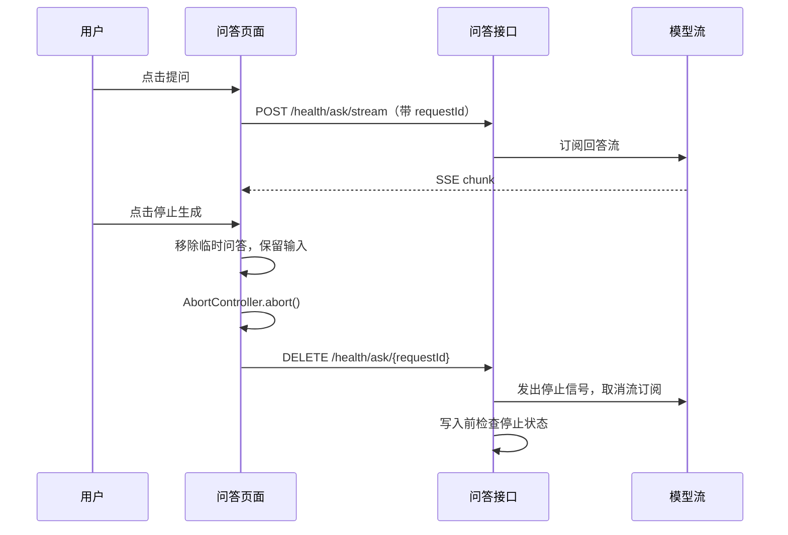

# 终止问答的实现方式

用户发现问题写错时，需要在回答尚未结束前停止生成，并保留输入框里的文字继续修改。本项目的问答通过 `fetch` 接收 SSE 流，因此停止操作涉及两个方向：浏览器停止接收，服务端停止模型流并决定是否保存本轮问答。

本文对应当前的 [`src/views/health/index.vue`](../../ruoyi-fast-vue3/src/views/health/index.vue)、[`src/api/health.js`](../../ruoyi-fast-vue3/src/api/health.js) 和 [`HealthController`](../ruoyi-admin/src/main/java/com/ruoyi/health/HealthController.java)。以下描述基于代码静态阅读；尚未运行程序验证。

## 先看完整流程



正常完成时，服务端写入问答，发送 `done` 事件，并启动后续记忆处理。停止信号先于写入到达时，服务端跳过写入，前端也不会显示这轮临时问答。

## 第一步：为每轮问答生成独立编号

页面在 [`submitQuestion`](../../ruoyi-fast-vue3/src/views/health/index.vue) 中为本轮创建 `AbortController`，用 `crypto.randomUUID()` 生成 `requestId`。编号随提问请求发送给服务端；页面同时保存当前控制器和编号，供“停止生成”按钮使用。

```js
const controller = new AbortController()
const requestId = crypto.randomUUID()
askController = controller
activeRequestId = requestId

await askHealth({ member, text, modelId, conversationId, requestId }, onChunk, controller.signal)
```

`conversationId` 标识聊天会话，`requestId` 标识**这一轮正在进行的请求**。同一会话可以有多轮提问，因此停止操作使用 `requestId`，避免误停其他轮次。

[`askHealth`](../../ruoyi-fast-vue3/src/api/health.js) 把 `signal` 传给原有的 `fetch` 请求。浏览器收到 `abort()` 后，请求或正在等待的 `reader.read()` 会以取消错误结束；页面据此结束本轮等待。

## 第二步：立即更新页面

生成期间，输入框右侧将“提问”按钮切换为“停止生成”。[`stopQuestion`](../../ruoyi-fast-vue3/src/views/health/index.vue) 先移除本轮临时的用户消息和助手消息，再调用 `askController.abort()`。输入框的 `question` 没有清空，用户可以直接修改原问题。

```js
messages.value.splice(activeStart, 2)
askController.abort()
generating.value = false
stopHealth(activeRequestId)
```

这里的 `activeStart` 是本轮临时消息在 `messages` 数组中的起点。流式回调还会检查 `controller.signal.aborted`，避免停止后已排队的片段继续追加到页面。`submitQuestion` 的异常处理也会识别主动取消，不把它当作普通问答失败提示。

浏览器断开连接只能保证页面不再接收内容；服务端可能正在做检索或等待模型输出。因此页面还会调用 [`stopHealth`](../../ruoyi-fast-vue3/src/api/health.js)，发送 `DELETE /health/ask/{requestId}`。

## 第三步：服务端登记并接收停止信号

[`HealthController.ask`](../ruoyi-admin/src/main/java/com/ruoyi/health/HealthController.java) 将登录账号编号和 `requestId` 组合为键，在 `activeAsks` 中保存这轮的 `AskCancellation`。这个对象包含两个部分：

| 字段 | 作用 |
| --- | --- |
| `state` | `RUNNING` 表示仍在生成，`CANCELLED` 表示已停止，`COMMITTED` 表示问答已经写入。 |
| `signal` | Reactor 的 `Sinks.One`，向模型流发出取消信号。 |

账号编号参与键的构造，停止接口也按当前登录账号查找请求，避免一个账号用其他账号的请求编号终止问答。停止接口使用 `computeIfAbsent`：如果停止请求比提问请求更早到达，也会先留下停止信号，待提问请求登记时读取。

```java
boolean stopped = stop.cancel();
```

`cancel()` 内部同步判断状态：只有 `RUNNING` 可以转为 `CANCELLED`，并向 `signal` 发出通知。停止接口返回布尔值：`true` 表示停止信号先于写入；`false` 表示问答已经写入。后者无法撤回，页面会提示用户并刷新历史对话列表。同步预处理阶段调用 `checkpoint()`，在记忆筛选或历史问题压缩等调用结束后及时退出已停止的请求。

## 第四步：取消模型流，守住写入边界

模型回答由 [`HealthModels.stream`](../ruoyi-admin/src/main/java/com/ruoyi/health/HealthModels.java) 返回 `Flux<String>`。控制器使用 `takeUntilOther` 把停止信号接到这个流上：

```java
try (Stream<String> chunks = models.stream(model, system, history, prompt)
        .takeUntilOther(stop.onCancel()).toStream()) {
    Iterator<String> iterator = chunks.iterator();
    while (iterator.hasNext()) {
        String chunk = iterator.next();
        if (stop.cancelled()) return;
        // 将片段写入 SSE 响应
    }
}
```

停止信号到达后，`takeUntilOther` 结束模型流的订阅；循环在处理片段前再次检查状态。`try` 块结束时还会关闭 Java `Stream`，释放与流订阅关联的资源。

回答流结束后，控制器通过 `stop.commit(...)` 写入问答。`commit()` 与 `cancel()` 都在同一个状态对象上同步，因此“停止”与“开始写入”有明确先后：

```java
synchronized boolean commit(Runnable save) {
    if (state != AskState.RUNNING) return false;
    save.run();
    state = AskState.COMMITTED;
    return true;
}
```

停止先取得这把锁时，`commit()` 返回 `false`，本轮不写入聊天消息，也不会执行后面的 `memories.afterAnswer`。写入先取得锁时，`save.run()` 完成后状态变为 `COMMITTED`；随后到达的停止请求会得到 `false`。控制器调用 `commit()` 前会先序列化来源列表，然后把 `chatMapper.insertExchange(...)` 作为写入操作传入。

## 第五步：清理请求状态

停止请求可能先于提问到达，因此服务端会暂时保留停止状态；正常写入后的状态也会短暂保留，用于识别“点击停止时其实已经完成”的情况。当前实现通过 `CompletableFuture.delayedExecutor` 在约一分钟后移除这些状态；未完成且已退出的请求会在 `finally` 中移除。

前端的 `finally` 则清除当前控制器、请求编号和临时消息起点，恢复按钮状态。这样下一轮问答会使用新的 `requestId`，不会复用上一轮的停止信号。

## 需要理解的边界

1. **同步预处理不会被即时打断。** 记忆筛选和历史问题压缩使用同步模型调用。停止信号如果在这些调用期间到达，服务端要等当前调用返回，再在后续检查点退出。
2. **已写入的问答无法撤销。** 如果服务端已完成写入并把状态设为 `COMMITTED`，停止接口会返回 `false`。页面会提示“回答已完成并保存”，并刷新历史列表。
3. **前端取消和服务端停止各有作用。** `AbortController` 负责立即停止页面等待；`DELETE` 接口负责通知服务端取消模型流和跳过尚未开始的写入。停止接口失败时，页面会提示用户稍后检查会话记录。
4. **取消只针对本轮。** 当前实现不会删除此前已经保存的会话消息，也不会改变其他请求的停止状态。

阅读代码时，可以从页面的 `stopQuestion` 开始，沿着 `stopHealth`、`HealthController.stopAsk`、`takeUntilOther`，最后看到 `insertExchange` 前的状态检查。这条链路解释了“点击停止”如何从一个按钮动作传到模型订阅和会话写入。
